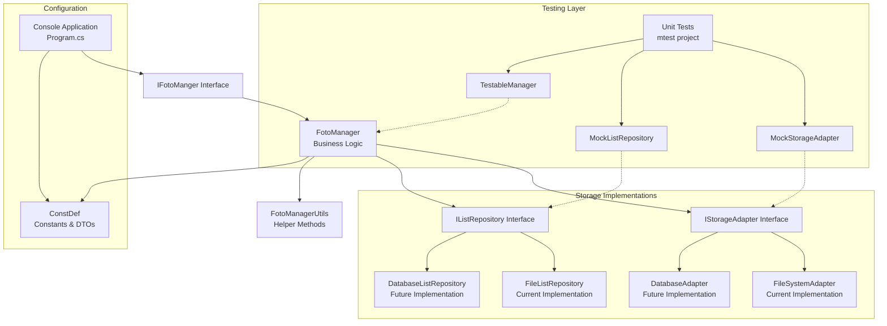

# Design Document

## Overview

The Photo Management Utility (foto_list) is architected as a layered system with clear separation of concerns between business logic, storage abstraction, and user interface. The design follows dependency injection principles and abstraction patterns to enable comprehensive testing and future extensibility, including storage backend replacement (file system to database) and web service migration.

The system consists of four main layers:
1. **Presentation Layer**: Console application (Program.cs) handling command-line arguments and user interaction
2. **Business Logic Layer**: FotoManager implementing core photo management operations
3. **Storage Abstraction Layer**: Interfaces defining storage contracts independent of implementation
4. **Infrastructure Layer**: Concrete implementations (FileSystem, future Database) providing actual storage operations

## Architecture

### High-Level Architecture Diagram



### Dependency Flow

The system follows a clean dependency flow where higher-level modules depend on abstractions rather than concrete implementations, enabling easy replacement of storage backends:

- **Program.cs** depends on **IFotoManger** interface
- **FotoManager** depends on **IStorageAdapter** and **IListRepository** interfaces
- **Storage implementations** can be file-based, database-based, or cloud-based
- **Repository implementations** handle list persistence independently of photo storage
- **Test doubles** can be injected for any abstraction layer

This design enables scenarios like:
- Photos stored in file system, lists in MySQL database
- Photos stored in cloud storage, lists in local files  
- Photos and lists both in database with different schemas
- Hybrid approaches mixing multiple storage types

## Components and Interfaces

### Core Interfaces

#### IFotoManger Interface
```csharp
public interface IFotoManger
{
    string CreateListFile(string listFileName);
    string GenerateDiffReports(string listFileName);
    string CleanPhoto(string listFileName, string reportFileName);
}
```

**Responsibilities:**
- Define the contract for all photo management operations
- Ensure consistent return types (string messages) for operation results
- Support dependency injection for testing and future web service integration

#### IStorageAdapter Interface
```csharp
public interface IStorageAdapter
{
    Task<bool> LocationExistsAsync(string location);
    Task<string> GetFullLocationAsync(string location);
    Task<IEnumerable<StorageItem>> GetItemsAsync(string location, string searchPattern);
    Task<IEnumerable<string>> GetSubLocationsAsync(string location);
    Task CreateLocationAsync(string location);
    Task<bool> ItemExistsAsync(string itemPath);
    Task MoveItemAsync(string sourcePath, string targetPath);
    string CombineLocation(params string[] paths);
    string GetItemNameWithoutExtension(string itemPath);
    string GetItemName(string itemPath);
    string GetItemExtension(string itemPath);
}

public class StorageItem
{
    public string Name { get; set; }
    public string FullPath { get; set; }
    public string NameWithoutExtension { get; set; }
    public DateTime LastModified { get; set; }
    public long Size { get; set; }
}
```

#### IListRepository Interface
```csharp
public interface IListRepository
{
    Task<IEnumerable<string>> ReadListAsync(string listIdentifier);
    Task<string> WriteListAsync(string listIdentifier, IEnumerable<string> items);
    Task<bool> ListExistsAsync(string listIdentifier);
    Task<string> GenerateListIdentifierAsync(string baseName, string prefix = null);
}
```

**Responsibilities:**
- **IStorageAdapter**: Abstract storage operations (file system, cloud, database blob storage)
- **IListRepository**: Abstract list persistence (text files, database tables, key-value stores)
- Enable comprehensive testing through mock implementations
- Support multiple storage backends simultaneously
- Provide async operations for scalability

### Business Logic Components

#### FotoManager Class

**Core Responsibilities:**
- Implement all photo management business logic
- Coordinate between file system operations and data processing
- Handle user input validation and error scenarios
- Generate appropriate status messages and reports

**Key Methods:**

1. **CreateListFile(string listFileName)**
   - Prompts user for photo directory path
   - Recursively scans directory structure using FotoManagerUtils
   - Generates sorted list of unique filenames (without extensions)
   - Creates desktop output file with timestamp-based naming

2. **GenerateDiffReports(string listFileName)**
   - Reads baseline list from specified file
   - Scans target directory for current files
   - Performs bidirectional comparison to identify missing files
   - Generates two separate reports: baseline diff and target diff

3. **CleanPhoto(string listFileName, string reportFileName)**
   - Reads baseline list and scans target directory
   - Identifies files not present in baseline
   - Creates "removed" subdirectories as needed
   - Moves non-baseline files to appropriate removed folders
   - Generates comprehensive removal report

#### FotoManagerUtils Class

**Static Utility Methods:**

1. **listAllFiles(IFileSystem, StringCollection, string, string, bool)**
   - Recursive directory traversal with configurable depth
   - File filtering (excludes hidden files starting with '.')
   - Duplicate prevention using StringCollection.Contains
   - Automatic sorting of results

2. **sortByName(StringCollection)**
   - Alphabetical sorting using Array.Sort for consistency
   - Handles null and empty collections gracefully

3. **checkFileName(IFileSystem, string, string, string)**
   - Prevents file overwrites by adding numeric prefixes
   - Maintains original filename structure for predictability

### Infrastructure Components

#### FileSystemAdapter Class (Current Implementation)

**Cross-Platform File System Implementation:**
- Wraps System.IO operations with consistent error handling
- Implements path normalization for Windows/Linux/macOS compatibility
- Provides unified interface for all file operations
- Maintains backward compatibility with existing IFileSystem interface

**Location Normalization Strategy:**
```csharp
public string CombineLocation(params string[] paths)
{
    var normalizedPaths = paths.Select(p => p.Replace('\\', Path.DirectorySeparatorChar)
                                           .Replace('/', Path.DirectorySeparatorChar))
                               .ToArray();
    return Path.Combine(normalizedPaths);
}
```

#### DatabaseAdapter Class (Future Implementation)

**Database Storage Implementation:**
```csharp
public class DatabaseAdapter : IStorageAdapter
{
    private readonly IDbConnection _connection;
    
    public async Task<IEnumerable<StorageItem>> GetItemsAsync(string location, string searchPattern)
    {
        // Query database for items matching location and pattern
        // Convert database records to StorageItem objects
        // Support SQL LIKE patterns for searchPattern
    }
    
    public async Task MoveItemAsync(string sourcePath, string targetPath)
    {
        // Update database record location/path
        // Handle actual file movement if files are stored separately
        // Maintain referential integrity
    }
}
```

#### FileListRepository Class (Current Implementation)

**Text File List Storage:**
- Reads/writes StringCollection to desktop text files
- Handles file naming conflicts with timestamp prefixes
- Provides cross-platform file path handling

#### DatabaseListRepository Class (Future Implementation)

**Database List Storage:**
```csharp
public class DatabaseListRepository : IListRepository
{
    public async Task<string> WriteListAsync(string listIdentifier, IEnumerable<string> items)
    {
        // Store list items in database table
        // Support versioning and metadata
        // Return database record identifier
    }
    
    public async Task<IEnumerable<string>> ReadListAsync(string listIdentifier)
    {
        // Query database for list items
        // Support filtering and sorting
        // Handle large lists with pagination
    }
}
```

#### Program Class (Console Application)

**Command-Line Interface Design:**
- Parameter parsing with support for --help, --compare, --clean, --path
- Input validation and error message display
- Manager instance management for testing support
- Cross-platform path normalization for user inputs

**Parameter Handling Flow:**
1. Parse command-line arguments
2. Validate parameter format and completeness  
3. Normalize file paths for current OS
4. Delegate to appropriate FotoManager method
5. Display results and wait for user acknowledgment

## Data Models

### Core Data Structures

#### StringCollection Usage
The system uses `System.Collections.Specialized.StringCollection` for file lists because:
- Optimized for string operations
- Provides efficient Contains() method for duplicate checking
- Supports easy conversion to/from arrays for sorting
- Maintains insertion order when needed

#### DiffReportDTO Class
```csharp
public class DiffReportDTO
{
    public string TotalBaselinePhotoNum { get; set; }
    public string TotalTargetFolderPhotoNum { get; set; }
    public StringCollection DelPhotos { get; set; }
    public StringCollection SubFolderNames { get; set; }
}
```

**Purpose:** Structured data transfer for future web service integration

### File Naming Conventions

#### Output Files
- **Baseline List**: `foto_list.txt` (default on desktop)
- **Diff Reports**: `file_missing_baseline.txt`, `file_missing_target.txt`
- **Removal Report**: `removed_foto_list.txt`
- **Timestamp Prefixes**: Second-based timestamps prevent overwrites

#### Directory Structure
- **Removed Files**: Stored in `removed/` subdirectories within target folders
- **Recursive Processing**: Maintains original directory hierarchy

## Error Handling

### Error Categories and Responses

#### Input Validation Errors
- **Invalid Directory Path**: Display `ConstDef.ConstErrFotoPath` with attempted path
- **Missing List File**: Return `ConstDef.ConstErrFotolistFile`
- **Invalid Parameters**: Show help and parameter guidance

#### File Operation Errors
- **Write Failures**: Return `ConstDef.ConstErrWriteFile + fileName`
- **Read Failures**: Graceful exception handling with boolean return values
- **Permission Issues**: Handled through IFileSystem abstraction

#### Cross-Platform Considerations
- **Path Separator Handling**: Automatic normalization in FileSystem.Combine
- **Case Sensitivity**: Consistent lowercase conversion in Program.NormalizePath
- **File Locking**: Handled through standard .NET File operations

### Exception Handling Strategy

```csharp
// Example from FotoManager.WriteListFile
try
{
    using (var outputFile = _fileSystem.CreateText(fileName))
    {
        foreach (var name in allFiles)
        {
            outputFile.WriteLine(name);
        }
    }
    message = ConstDef.ConstMesgReturnList + fileName;
}
catch
{
    message = ConstDef.ConstErrWriteFile + fileName;
}
```

**Principles:**
- Catch exceptions at operation boundaries
- Return meaningful error messages rather than throwing
- Log operation results to console for user feedback
- Maintain system stability through graceful degradation

## Testing Strategy

### Test Architecture

#### Unit Test Structure
- **Test Project**: `mtest` using xUnit framework
- **Mock Objects**: `MockFileSystem` implementing `IFileSystem`
- **Testable Components**: `testableFotoManager` exposing protected methods
- **Dependency Injection**: `Program.Manager` property for test doubles

#### Test Categories

1. **Core Operations Testing**
   - File list creation with various directory structures
   - Diff report generation with different file sets
   - Clean operations with complex directory hierarchies

2. **Cross-Platform Testing**
   - Path normalization across Windows/Linux/macOS
   - Case sensitivity handling
   - Directory separator consistency

3. **Error Scenario Testing**
   - Invalid paths and missing files
   - File system permission errors
   - Concurrent access scenarios

4. **Performance Testing**
   - Large file collection handling
   - Memory usage during recursive scanning
   - Sorting performance with thousands of files

#### Mock Implementation Strategy

```csharp
public class MockFileSystem : IFileSystem
{
    public bool DirectoryExistsResult { get; set; } = true;
    public string[] GetFilesResult { get; set; } = new string[0];
    public bool OpenTextThrowException { get; set; } = false;
    
    // Implementation delegates to configurable test behavior
}
```

**Benefits:**
- Deterministic test behavior
- Simulation of error conditions
- Fast test execution without real I/O
- Comprehensive coverage of edge cases

### Integration Testing Approach

#### Real File System Testing
- Limited integration tests with temporary directories
- Verification of actual cross-platform behavior
- End-to-end workflow validation

#### CI/CD Considerations
- Tests run quickly (< 1 second each)
- No external dependencies required
- Platform matrix testing (Windows/Linux/macOS)
- Automated test execution with `dotnet test`

## Future Extensibility

### Storage Backend Flexibility

#### Supported Migration Scenarios

1. **File System to Database Migration**
   ```csharp
   // Current: File-based storage
   services.AddScoped<IStorageAdapter, FileSystemAdapter>();
   services.AddScoped<IListRepository, FileListRepository>();
   
   // Future: Database storage
   services.AddScoped<IStorageAdapter, DatabaseAdapter>();
   services.AddScoped<IListRepository, DatabaseListRepository>();
   
   // Hybrid: Photos in files, lists in database
   services.AddScoped<IStorageAdapter, FileSystemAdapter>();
   services.AddScoped<IListRepository, DatabaseListRepository>();
   ```

2. **Cloud Storage Integration**
   ```csharp
   // Cloud photos with local list cache
   services.AddScoped<IStorageAdapter, CloudStorageAdapter>();
   services.AddScoped<IListRepository, CachedListRepository>();
   ```

3. **Multi-Tenant Database Design**
   ```sql
   -- Photos table for database storage
   CREATE TABLE Photos (
       Id BIGINT PRIMARY KEY,
       TenantId INT,
       Name NVARCHAR(255),
       FullPath NVARCHAR(500),
       Location NVARCHAR(500),
       LastModified DATETIME,
       Size BIGINT,
       INDEX idx_tenant_location (TenantId, Location)
   );
   
   -- Lists table for list repository
   CREATE TABLE PhotoLists (
       Id BIGINT PRIMARY KEY,
       TenantId INT,
       ListIdentifier NVARCHAR(255),
       ItemName NVARCHAR(255),
       CreatedDate DATETIME,
       INDEX idx_tenant_list (TenantId, ListIdentifier)
   );
   ```

### Web Service Migration Readiness

#### Current Architecture Benefits
- **Clean Separation**: Business logic isolated from console I/O and storage implementation
- **Interface Abstractions**: Easy to wrap in HTTP controllers with different storage backends
- **Dependency Injection**: Ready for ASP.NET Core DI container with configurable storage
- **Stateless Operations**: All methods are stateless and thread-safe
- **Async Ready**: New interfaces support async operations for web scalability

#### Recommended Migration Path

1. **Phase 1: Interface Evolution**
   ```csharp
   // Evolve IFotoManger to support async and multiple storage backends
   public interface IFotoManger
   {
       Task<string> CreateListFileAsync(string listFileName, CancellationToken cancellationToken = default);
       Task<string> GenerateDiffReportsAsync(string listFileName, CancellationToken cancellationToken = default);
       Task<string> CleanPhotoAsync(string listFileName, string reportFileName, CancellationToken cancellationToken = default);
   }
   ```

2. **Phase 2: Storage Configuration**
   ```csharp
   // appsettings.json configuration for different storage backends
   {
     "PhotoManagement": {
       "StorageType": "Database", // or "FileSystem", "Cloud", "Hybrid"
       "ConnectionString": "Server=localhost;Database=PhotoDB;",
       "FileSystemRoot": "/photos",
       "CloudProvider": "Azure" // or "AWS", "GCP"
     }
   }
   ```

3. **Phase 3: Web API Implementation**
   ```csharp
   [ApiController]
   [Route("api/[controller]")]
   public class PhotoController : ControllerBase
   {
       private readonly IFotoManger _fotoManager;
       private readonly IStorageAdapter _storageAdapter;
       
       public PhotoController(IFotoManger fotoManager, IStorageAdapter storageAdapter)
       {
           _fotoManager = fotoManager;
           _storageAdapter = storageAdapter;
       }
       
       [HttpPost("create-list")]
       public async Task<ActionResult<OperationResult>> CreateList([FromBody] CreateListRequest request)
       {
           // Validate request and delegate to business logic
           // Support different storage backends transparently
       }
   }
   ```

4. **Phase 4: Advanced Features**
   - Multi-tenant support with tenant-specific storage configurations
   - Background job processing for long operations
   - Real-time progress updates via SignalR
   - Caching strategies for frequently accessed lists

#### API Design Considerations

**RESTful Endpoints:**
- `POST /api/photo/create-list` - Create baseline list
- `POST /api/photo/compare` - Generate diff reports  
- `POST /api/photo/clean` - Perform clean operation
- `GET /api/photo/status/{jobId}` - Check operation status

**Request/Response Models:**
```csharp
public class CreateListRequest
{
    public string DirectoryPath { get; set; }
    public string OutputFileName { get; set; }
}

public class OperationResult
{
    public bool Success { get; set; }
    public string Message { get; set; }
    public string[] OutputFiles { get; set; }
}
```

This design maintains the current CLI functionality while providing a clear path for web service evolution, ensuring the investment in the current architecture supports future requirements.
##
# Configuration-Driven Storage Selection

#### Storage Provider Factory Pattern

```csharp
public interface IStorageProviderFactory
{
    IStorageAdapter CreateStorageAdapter(StorageConfiguration config);
    IListRepository CreateListRepository(StorageConfiguration config);
}

public class StorageConfiguration
{
    public StorageType StorageType { get; set; }
    public string ConnectionString { get; set; }
    public string FileSystemRoot { get; set; }
    public CloudProviderSettings CloudSettings { get; set; }
    public Dictionary<string, string> AdditionalSettings { get; set; }
}

public enum StorageType
{
    FileSystem,
    Database,
    Cloud,
    Hybrid
}
```

#### Dependency Injection Configuration

```csharp
// Startup.cs or Program.cs
public void ConfigureServices(IServiceCollection services)
{
    var storageConfig = Configuration.GetSection("PhotoManagement").Get<StorageConfiguration>();
    
    services.AddSingleton(storageConfig);
    services.AddScoped<IStorageProviderFactory, StorageProviderFactory>();
    
    // Factory creates appropriate implementations based on configuration
    services.AddScoped<IStorageAdapter>(provider =>
    {
        var factory = provider.GetService<IStorageProviderFactory>();
        return factory.CreateStorageAdapter(storageConfig);
    });
    
    services.AddScoped<IListRepository>(provider =>
    {
        var factory = provider.GetService<IStorageProviderFactory>();
        return factory.CreateListRepository(storageConfig);
    });
    
    services.AddScoped<IFotoManger, FotoManager>();
}
```

This design ensures that the system can evolve from a simple file-based CLI tool to a sophisticated web service with database storage, cloud integration, or hybrid approaches, all while maintaining the core business logic and enabling comprehensive testing at every layer.